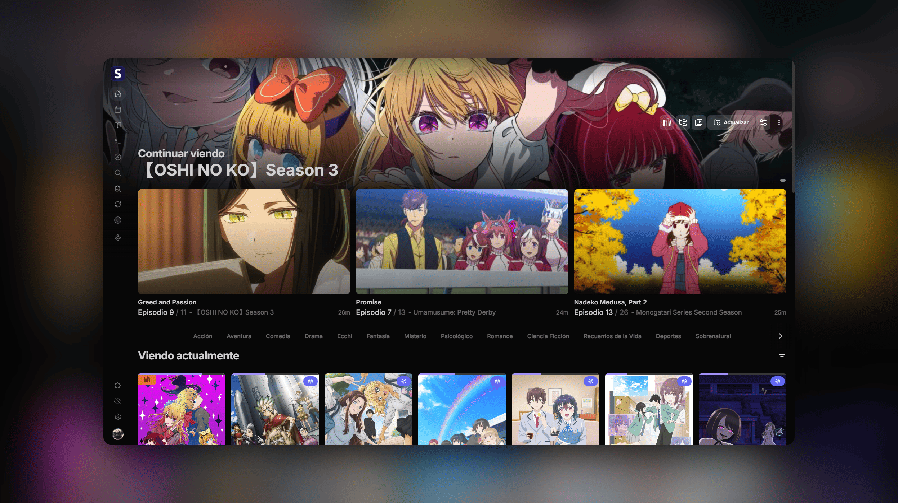

<h1 align="center"><b>Seanime Esp</b></h1>

  <b>Fork Multilingüe de Seanime (con foco principal en Español)</b> — Media server con interfaz web y app de escritorio para anime y manga

  <a href="https://github.com/5rahim/seanime">Proyecto Original</a> |
  <a href="https://seanime.app/docs">Documentación</a> |
  <a href="https://github.com/Anthony00q/Seanime_Esp/releases">Última release</a> |
  <a href="https://seanime.app/docs/policies">Copyright</a> |
  <a href="https://discord.gg/Sbr7Phzt6m">Discord</a>

  
  
  

<h5 align="center">
Si te gusta el proyecto, ¡deja una estrella en este y en el <a href="https://github.com/5rahim/seanime">repositorio original</a>! ⭐️
</h5>

---

## ¿Qué es este fork?

Este es un **fork multilingüe** del proyecto [Seanime](https://github.com/5rahim/seanime) creado por [5rahim](https://github.com/5rahim).

**Objetivo:** Transformar el proyecto en un servidor escalable a múltiples idiomas (Español, Portugués, etc.) con foco principal en la comunidad hispanohablante, implementando una arquitectura de internacionalización (que el original no posee) y manteniendo el proyecto intacto y actualizado.

**Estructura de ramas:**
- `main` → espejo puro del upstream (sin modificaciones)
- `traduccion-es` → rama de trabajo con las traducciones al español

> [!IMPORTANT]
> Seanime no proporciona, aloja ni distribuye contenido multimedia. Los usuarios son responsables de obtener contenido por medios legales y cumplir con las leyes locales. Las extensiones listadas en la app no están afiliadas con Seanime y pueden ser eliminadas si violan leyes de derechos de autor.

---

## Características

🎬 **Streaming y Reproducción**
- **Múltiples Fuentes**: Streaming en línea, reproducción directa de Torrents y visualización local.
- **Seanime Denshi**: Cliente de escritorio con reproductor de video integrado (soporte para subtítulos SSA/ASS, Anime4K y más).
- **Flexibilidad de Reproductores**: Integración impecable con MPV, VLC y MPC-HC, además de Transcoding en tiempo real para navegadores.

📚 **Gestión de Biblioteca y Colecciones**
- **Escaneo Inteligente**: Reconocimiento automático de tus archivos locales sin forzar convenciones de nombres estrictas.
- **Ecosistema AniList**: Integración total para gestionar tus listas, descubrir anime y rastrear estrenos (Horario).
- **Lector de Manga y Auto-Descargas**: Lector integrado y rastreo/descarga automática de nuevos episodios.
- **Fuentes Personalizadas y Offline**: Añade series fuera de AniList y accede a tu biblioteca sin conexión a internet.

💻 **Sistema y Personalización**
- **Multiplataforma**: Compatible con Windows, Linux y macOS.
- **Tienda de Extensiones**: Repositorio integrado para potenciar la búsqueda y el streaming.
- **Personalización Visual**: Temas de color, imágenes de fondo personalizadas y opciones avanzadas de diseño.
- **Discord Rich Presence**: Comparte automáticamente lo que estás viendo.

---

## 📥 Cómo Empezar (Instalación)

1. Ve a la página de [Releases](https://github.com/Anthony00q/Seanime_Esp/releases).
2. Descarga la versión correspondiente a tu sistema operativo (Windows, macOS o Linux).
3. Descomprime y ejecuta la aplicación.

> [!CAUTION]
> **Instalación Limpia Requerida:** Si ya tenías instalada la versión original de Seanime (en inglés), **debes eliminarla por completo** antes de instalar esta nueva versión. Esto es crucial para evitar conflictos críticos o errores con las bases de datos y configuraciones del programa anterior.

---

## Arquitectura y Progreso de Traducción

El proyecto original no tiene soporte nativo para múltiples idiomas (i18n), por lo que se implementó desde cero una robusta arquitectura de traducción basada en JSON.

### 🌍 Estado Actual (Traducción Completa)

Actualmente, la traducción abarca el **100% de la interfaz de forma nativa para Español y Portugués (pt-BR)**, y el proyecto está diseñado arquitectónicamente para soportar cualquier idioma adicional con facilidad. Se mantiene en revisión continua para pulir contextos, asegurar la naturalidad gramatical y garantizar que cualquier nueva función añadida en el original sea adaptada sin demoras.

**Detalles Técnicos del Sistema:**
- **~3550+ keys** en 18 archivos JSON, con validación de tipo estricta para evitar errores.
- **Backend Go intacto** — Los mensajes nativos del servidor se interceptan y traducen en el frontend (`SERVER_TOAST_MAP`).
- **Fechas y Calendarios** — Adaptación dinámica total del formato de fechas usando `date-fns` y parches de capitalización idiomática.
- **Cero Hardcoding** — Ni un solo string visible "quemado" directamente en el código de React.
- **Soporte Escalable** — Arquitectura modular que permite a cualquier contribuidor agregar nuevos idiomas fácilmente siguiendo la guía `Traducciones.md`.

**Áreas y Componentes Traducidos:**
Se han adaptado más de **310 componentes React** y **247 notificaciones**, cubriendo absolutamente toda la experiencia:
- **Core Visual:** Navegación, Paleta de Comandos (Sea Command), Pantalla de Inicio, Descubrimiento y Asistente de Configuración.
- **Consumo:** Reproductor de Video integral (Subtítulos, Chromecast, Anime4K), Lector de Manga interactivo y Watch Parties (Nakama).
- **Gestión:** Configuraciones Avanzadas, Escáner de Biblioteca local, Explorador, Descargador Automático y Tienda de Extensiones.
- **AniList y Metadatos:** Diccionario completo integrado (411 keys para géneros, formatos, estados), Seguimiento de Progreso y Listas offline.

---

## Stack Tecnológico

| Capa | Tecnología |
|------|-----------|
| **Servidor** | [Go](https://go.dev/) |
| **Frontend** | [React](https://reactjs.org/), [Rsbuild/Rspack](https://rsbuild.rs/), [TanStack Router](https://tanstack.com/router) |
| **Escritorio** | [Electron](https://www.electronjs.org/) |

---

## Desarrollo y Build

Consulta la guía completa en [DEVELOPMENT_AND_BUILD.md](DEVELOPMENT_AND_BUILD.md).

---

## Créditos

Este proyecto es un fork de [Seanime](https://github.com/5rahim/seanime), creado por [5rahim](https://github.com/5rahim).

Si te gusta este proyecto, considera **sponsorizar al creador original**:

  

---

> [!NOTE]
> Para consultas relacionadas con los derechos de autor, póngase en contacto con el responsable del mantenimiento utilizando la información de contacto que aparece en [EL SITIO WEB](https://seanime.app/docs/policies).
