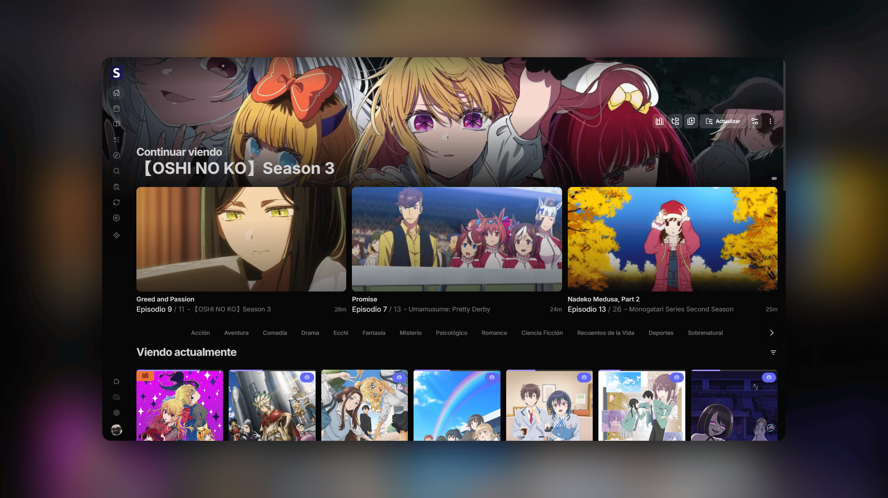

<h1 align="center"><b>Seanime Esp</b></h1>

  <b>Fork Multilíngue do Seanime (com foco principal em Espanhol)</b> — Media server com interface web e app desktop para anime e mangá

  <a href="./README.md">Español</a> |
  <strong>Português</strong> |
  <a href="./README.en.md">English</a>

  <a href="https://github.com/5rahim/seanime">Projeto Original</a> |
  <a href="https://seanime.app/docs">Documentação</a> |
  <a href="https://github.com/Anthony00q/Seanime_Esp/releases">Última release</a> |
  <a href="https://seanime.app/docs/policies">Copyright</a> |
  <a href="https://discord.gg/Sbr7Phzt6m">Discord</a>

  
  
  

<h5 align="center">
Se você gosta do projeto, deixe uma estrela neste e no <a href="https://github.com/5rahim/seanime">repositório original</a>! ⭐️
</h5>

---

## O que é este fork?

Este é um **fork multilíngue** do projeto [Seanime](https://github.com/5rahim/seanime) criado por [5rahim](https://github.com/5rahim).

**Missão:** Transformar o Seanime em uma plataforma globalmente acessível através de uma arquitetura robusta de internacionalização (i18n), recurso ausente no projeto base. Nosso foco principal é a comunidade hispânica e lusófona, garantindo paridade total e imediata com as atualizações do projeto original.

**Estrutura de branches:**
- `main` → espelho puro do upstream (sem modificações)
- `traducciones` → branch de trabalho com as traduções

> [!IMPORTANT]
> O Seanime não fornece, hospeda nem distribui conteúdo multimídia. Os usuários são responsáveis por obter conteúdo por meios legais e cumprir as leis locais. As extensões listadas no app não são afiliadas ao Seanime e podem ser removidas se violarem leis de direitos autorais.

---

## Funcionalidades

- **Multiplataforma**: Interface web e aplicativo desktop para Windows, Linux e macOS, acessível por dispositivos iOS e Android.
- **Seanime Denshi**: Cliente desktop com player de vídeo integrado baseado em libmpv (suporte a legendas SSA/ASS, shaders e mais).
- **Integração com AniList**: Explore e gerencie suas listas, descubra anime e mangá.
- **Fontes Personalizadas**: Suporte para adicionar anime e mangá que não estão no AniList.
- **Gerenciamento de Biblioteca**: Escaneamento rápido e inteligente de arquivos locais sem convenções rígidas de nomenclatura nem estruturas de pastas obrigatórias.
- **Integração com Torrents**: Motor de busca de torrents integrado via extensões e suporte a downloads com qBittorrent, Transmission, TorBox, Real-Debrid, AllDebrid e Premiumize.
- **Streaming de Torrents**: Transmita torrents diretamente para o player de vídeo sem esperar o download terminar (suporte a BitTorrent, TorBox, Real-Debrid, AllDebrid e Premiumize).
- **Streaming Online**: Assista anime de fontes online diretamente no aplicativo via extensões.
- **Downloads Automáticos**: Rastreie e baixe automaticamente novos episódios com filtros personalizáveis e recursos avançados (priorização, pontuação, atraso, etc.).
- **Catálogo de Extensões**: Repositório dentro do app para instalar e gerenciar extensões de streaming online, fontes de mangá e provedores de torrent.
- **Leitor de Mangá**: Leia capítulos da sua biblioteca local ou via extensões com uma interface unificada.
- **Transcoding e Direct Play**: Transmita sua biblioteca para o navegador de qualquer dispositivo com transcodificação em tempo real ou reprodução direta.
- **Suporte a Players Externos**: Integração perfeita com MPV, VLC e MPC-HC no desktop.
- **Integração com Players Móveis**: Abra arquivos e transmissões em players móveis (Outplayer, VLC, etc.) via intents ou deep links.
- **Playlists**: Crie e gerencie playlists para uma experiência de visualização contínua.
- **Interface Personalizável**: Personalize a interface com temas de cores, imagens de fundo e opções de layout.
- **Discord Rich Presence**: Exiba sua atividade de visualização automaticamente.
- **Modo Offline**: Acesse sua biblioteca de anime e mangá sem conexão com a internet.
- **Calendário**: Acompanhe os próximos lançamentos e episódios perdidos.

---

## 📥 Como Começar (Instalação)

1. Acesse a seção de [Releases](https://github.com/Anthony00q/Seanime_Esp/releases).
2. Baixe o arquivo compactado correspondente ao seu sistema operacional (Windows, Linux ou macOS).
3. Extraia o arquivo em uma pasta de sua preferência e execute o aplicativo.

> [!CAUTION]
> Se você já tem a versão original do Seanime instalada, remova-a completamente antes de usar este fork. Certifique-se também de apagar sua pasta de dados, localizada no diretório de configuração de aplicativos do seu sistema operacional.

---

## Arquitetura e Progresso da Tradução

O projeto original não possui suporte nativo a múltiplos idiomas (i18n), por isso foi implementada do zero uma arquitetura robusta de tradução baseada em JSON.

### 🌍 Estado Atual (Tradução Completa)

O ecossistema atual cobre **100% da interface de forma nativa em Espanhol, Inglês e Português (pt)**. A grande novidade é que o idioma é totalmente dinâmico: os usuários podem alternar livremente entre os três idiomas nas Configurações, aplicando as mudanças em tempo real em toda a interface. Além disso, a arquitetura modular projetada permite escalar para qualquer idioma adicional sem atrito. É feita uma manutenção constante para refinar o contexto, garantir a naturalidade da linguagem e assegurar que cada atualização do projeto original seja adaptada imediatamente ao ser lançada.

**Detalhes Técnicos do Sistema:**
- **Milhares de keys** de tradução em 25 arquivos JSON modulares, com validação de tipos estrita para evitar erros.
- **Backend Go intacto** — As mensagens nativas do servidor são interceptadas e traduzidas no frontend (`SERVER_TOAST_MAP`).
- **Datas e Calendários** — Adaptação dinâmica total do formato de datas usando `date-fns` e patches de capitalização idiomática.
- **Zero Hardcoding** — Nenhuma string visível "hardcoded" diretamente no código React.
- **Suporte Escalável** — Arquitetura modular que permite a qualquer contribuidor adicionar novos idiomas facilmente seguindo o guia `Traduções.md`.

**Áreas e Componentes Traduzidos:**
Mais de **300 componentes React** e **centenas de notificações** do servidor foram adaptados, cobrindo absolutamente toda a experiência:
- **Core Visual:** Navegação, Paleta de Comandos (Sea Command), Tela Inicial, Descoberta e Assistente de Configuração.
- **Consumo:** Player de Vídeo integral (Legendas, Chromecast, Anime4K), Leitor de Mangá interativo e Watch Parties (Nakama).
- **Gerenciamento:** Configurações Avançadas, Scanner da Biblioteca local, Explorador, Downloader Automático e Loja de Extensões.
- **AniList e Metadados:** Dicionário completo integrado (centenas de keys para gêneros, formatos, status, temporadas e tags), Acompanhamento de Progresso e Listas offline.

---

## Stack Tecnológico

| Camada | Tecnologia |
|------|-----------|
| **Servidor** | [Go](https://go.dev/) |
| **Frontend** | [React](https://reactjs.org/), [Rsbuild/Rspack](https://rsbuild.rs/), [TanStack Router](https://tanstack.com/router) |
| **Desktop** | [Electron](https://www.electronjs.org/) |

---

## Desenvolvimento e Build

Consulte o guia completo em [DEVELOPMENT_AND_BUILD.md](DEVELOPMENT_AND_BUILD.md).

---

## Créditos

Este projeto é um fork do [Seanime](https://github.com/5rahim/seanime), criado por [5rahim](https://github.com/5rahim).

Se você gosta deste projeto, considere **patrocinar o criador original**:

  

---

> [!NOTE]
> Para consultas relacionadas a direitos autorais, entre em contato com o mantenedor usando as informações de contato em [O SITE](https://seanime.app/docs/policies).
